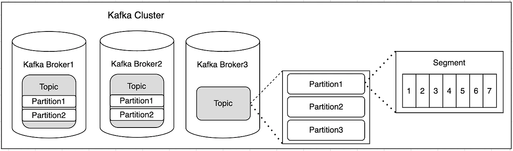

## Apache Kafka 란? 

#### Kafka는 실시간 데이터 스트리밍, 대규모 데이터 처리, 비동기 마이크로서비스 통신에서 사용되는 분산 이벤트 스트리밍 플랫폼.
- 데이터를 발행(Publish), 구독(Subscribe) 하여 데이터를 저장하고 분석하는데 사용
- 높은 처리량과, 낮은 지연 시간을 보장(Real Time: 실시간 처리)
- 데이터를 안전하게 보관하고, 복제하여 데이터 유실을 방지

### Kafka 구조

--- 
### 사용 예시
1. <b>실시간 데이터 파이프라인</b>
   - 데이터를 수집, 처리, 저장소로 전달하는데 사용
   - 예) 로그 데이터 수집, Application 이벤트 전달
2. <b>실시간 스트리밍</b>
   - 실시간 분석이나, 이벤트 처리에 사용, 대시보드 구축
   - 예) IoT 센서 데이터 처리, 클릭 스트림 분석 등등
3. <b>이벤트 기반 시스템</b>
   - MSA 간 비동기 통신
   - 예) 주문, 결제, 배송 서비스간 통신, 사용자 요청로그추적, 실시간 알림서비스 등등(이메일, 채팅 등등)
---
### Kafka 성능
1. 처리량
   - 초당 수백만 메시지 처리가능 (트위터)
   - 고성능: 레이턴시가 10ms 이하, 실시간 시스템에 적합
2. 확장성
   - 브로커와 파티션을 추가하여 무중단 확장 가능
   - 수천대의 브로커, 수십만개의 파티션을 지원
3. 내구성
   - 메시지 데이터는, Disk 에 저장되어 장애 복구 가능.
--- 
### Kafka 용어 정리
1. <b>Producer</b>
   - 데이터를 발행하는 클라이언트
   - Topic 에 데이터를 보내는 역할
2. <b>Consumer</b>
    - 데이터를 구독하는 클라이언트
    - Topic 에서 데이터를 가져오는 역할
3. <b>Topic</b>
    - 메시지가 저장되는 카테고리
    - 데이터를 구분하는 단위
    - 예) "user-logs" Topic 에 사용자 로그데이터 저장
4. <b>Partition</b>
    - Topic 을 여러개로 나누어 저장하는 단위
    - 데이터를 병렬로 처리하기 위해 사용
    - 각 Topic 은 1개 이상의 Partition 을 갖고 있음.
    - 속도에 영향 존재함
      - 1개의 Topic 에 MSG 를 보내는데 1초가 걸린다먀ㅕㄴ
        - 파티션1개: 4초
        - 파티션4개: 1초
        - 즉 분산 처리 가능하게 함.
      - Repilica(복제) : 파티션의 복제본, 복제 수(replication factor) 만큼 파티션의 복제본이 각 브로커에 생성됨.
5. <b>Broker</b>
    - Kafka 서버(인스턴스)
    - Topic 을 저장하고, Producer 와 Consumer 가 데이터를 주고받을 수 있도록 도와줌
    - 여러개의 Broker 를 묶어서 Kafka Cluster 를 구성
6. <b>Cluster</b>
    - 여러개의 Broker 를 묶어서 구성한 Kafka 시스템
    - 데이터를 복제하여 안정성을 보장
7. <b>Offset</b>
   - 각 메시지의 고유 번호 
   - Partition 내에서 메시지의 위치
   - Consumer 는 Offset 을 통해 메시지를 추적
8. <b>Zookeeper</b>
   - Kafka Cluster 의 메타데이터 관리
   - Broker, Topic, Partition, Offset 정보를 저장
   - Kafka Cluster 의 상태를 관리
   - 최신 버전에서는 Zookeeper 를 대체하는 KRaft(Kafka 내부에 존재함) 를 사용
     - 파티션을 10만개 이상 만들때, Zookeeper 가 부하가 걸리는 문제 발생
---
### 활용
- Docker 를 통해서, 여러개의 브로커로 클러스터 구성 가능.
- UI 툴을 통해 CLI 없이도 Kafka 관리, 사용이 가능함(UI: Kafka Manager, Kafka Tool, Conduktor 등)
- 