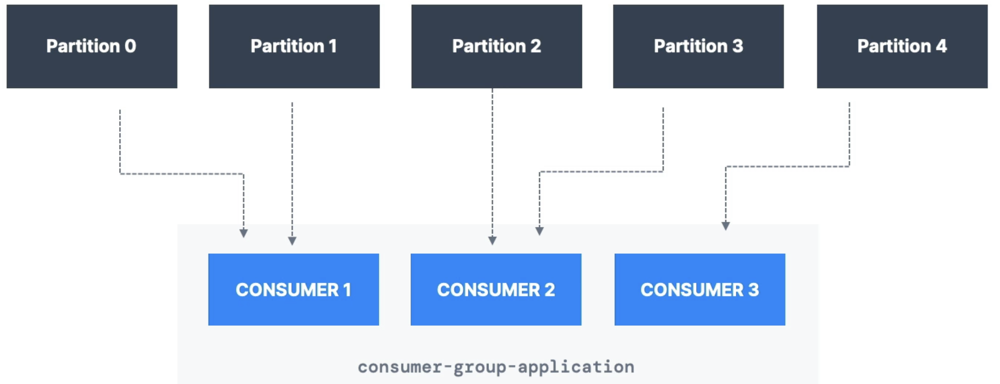
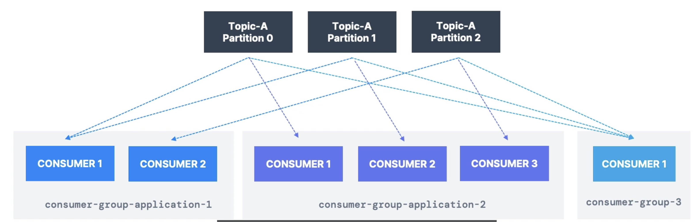

## Kafka CLI

- Kafka CLI 는 Kafka 를 관리하고, 테스트하는데 사용된다.
- Kafka Binary 와 함께 bundle 로 제공된다.
- Server 에 Kafka 를 설치하게 되면, Kafka CLI 를 전역적으로 사용할 수 있다.(Docker X)
- Binary 설치 후 환경변수 등록 했다면 (MAC, Linux: .sh, Windows: .bat, homebrew, apt: 확장자 없이) 사용가능하다.
  - Docker 의 경우 확장자 없이 사용하는 걸로 확인.
  - 또는 /bin/ 경로에 있는 명령어를 사용한다. (kafka-{} 명령어들이 존재함.)
> #### Options! 
> - --bootstrap-server 옵션은 항상 사용되며, --zookeeper 옵션은 사용하지 않는다.
>
> #### 보안설정
> - https://milvus.io/docs/ko/connect_kafka_ssl.md 참고
> - SASL/PLAIN 인증을 사용하려면, --command-config 옵션을 사용한다.
> - 해당 설정에는 username,password 및 PlainLoginModule required 옵션을 포함한다.
> - Docker 로 Instance 를 생성한 경우, Compose 파일에 환경변수를 추가하여 설정할 수 있다.

---
## 1. Kafka Topic CLI
- CLI 를 통해 Topic 을 관리를 할 수 있음.
- alter 명령어로 partition 의 갯수를 늘리면 다시 줄일수는 없음.
> - Topic 생성, 삭제
> - Topic List 조회
> - Topic 상세정보 조회
> - Topic 의 파티션 갯수 변경

```bash
# 각 옵션들을 모두 사용하여 Topic 생성시 설정을 진행할 수 있음(토픽명, 파티션갯수, 복제계수)
# Topic 생성
kafka-topics --bootstrap-server localhost:9092 --create --topic {toic 명}

# Topic 생성시 파티션 갯수 지정
kafka-topics --bootstrap-server localhost:9092 --create --topic {toic 명} --partitions {갯수}

# Topic 생성시 복제본 갯수 지정
kafka-topics --bootstrap-server localhost:9092 --create --topic {toic 명} --replication-factor {갯수}

# Topic 삭제
kafka-topics --bootstrap-server localhost:9092 --delete --topic {toic 명}

# Topic List 조회
kafka-topics --bootstrap-server localhost:9092 --list

# Topic 상세정보 조회
kafka-topics --bootstrap-server localhost:9092 --describe --topic {toic 명}

# Topic 파티션 갯수 변경
kafka-topics --bootstrap-server localhost:9092 --alter --topic {toic 명} --partitions {갯수}
```
---
## 2. Kafka Producer CLI
- Kafka-console-producer(.sh) 를 사용하여 Producer 를 실행할 수 있다.
- Topic 이 자동으로 생성될 수 있지만 해당 기능은 OFF 하는것이 권장됨
- Key 를 지정하지 않는경우 default:null 로 전송된다.
> - Producer MSG 전송시 Key 를 지정하지 않는경우
> - Producer MSG 전송시 Key 를 지정하는 경우
> - Topic 이 사전에 생성되어 있어야 함.

```bash
# Test Topic 생성
kafka-topics --bootstrap-server localhost:9092 --create --topic first_topic --partitions 1

# Producer - 특정 토픽 메시지 전송
kafka-console-producer --bootstrap-server localhost:9092 --topic {Topic 명}

# 보안설정이 되어있는경우?
kafka-console-producer --bootstrap-server localhost:9092 --topic {Topic 명} --producer.config {client-ssl.properties}

# Producer-property 사용(acks 확인)
kafka-console-producer --bootstrap-server localhost:9092 --topic {Topic 명} --producer-property acks=all

# 이미 존재하는 Topic 에 key 를 지정하여 Producer 전송
# key.separator 를 사용하여 key 와 value 를 구분한다. (key:value) -> (key.separator=, 라면 key,value)
# 추후 파티션이 여러개이고, 파티션에 따라 key 가 다르게 전송되는 경우, key 를 지정하여 전송할 수 있다.(지정된 key 로 파티션을 찾아서 전송)
# 해당 옵션으로 producer 를 실행하고, key:value 형태가 아닌것으로 메세지를 보내면 Exception 발생.
kafka-console-producer --bootstrap-server localhost:9092 --topic {Topic 명} --property parse.key=true --property key.separator=:

# Round Robin 방식으로 Producer 전송(모든 파틱션에 고르게 메시지 분배) - Test Only(운영 사용 X)
kafka-console-producer --bootstrap-server localhost:9092 --producer-property partitioner.class=org.apache.kafka.clients.producer.RoundRobinPartitioner --topic {Topic 명}
```
---
## 3. Kafka Consumer CLI
- Kafka-console-consumer(.sh) 를 사용하여 Consumer 를 실행할 수 있다.

> - Topic 의 Tail 에서부터 Consume(메시지 소비)
> - Topic 의 Head(Beginning) 에서부터 Consume(메시지 소비)
> - 옵션추가: key,value 확인
> #### Test 시 partitions 3 인 Topic 생성 후 Test

```bash
# 현재 Topic 에서 메시지를 소비 (새로들어온것만 소비)
kafka-console-consumer --bootstrap-server localhost:9092 --topic {Topic 명}

# Topic 의 Head(Beginning) 에서부터 메시지를 소비 - 순서를 보장하지않는다 -> 데이터가 파티션별로 차례로 Consume 하기 때문.
# 파티션이 1개라면 -> 순서를 보장한다는 말과 같음.
kafka-console-consumer --bootstrap-server localhost:9092 --topic {Topic 명} --from-beginning

# key,value 와 파티션 번호 확인 + TimeStamp - 처음것부터 Consume
# formatter = CLI 에서 출력되는 형식을 지정, timestamp=true : 메시지가 수신된 시간을 출력, partition=true : 파티션 번호 출력
kafka-console-consumer --bootstrap-server localhost:9092 --topic {topic 명} \
--formatter kafka.tools.DefaultMessageFormatter \
--property print.key=true \
--property print.value=true \
--property print.timestamp=true \
--property print.partition=true \
--from-beginning
```
> #### Options
> - --max-messages {number}: 최대 메시지 갯수 지정 (메시지 갯수 제한)
> - --timeout-ms {number}: 타임아웃 지정 (타임아웃 설정)
> - --property {property}: 추가 속성 지정 (추가 속성 지정)
> - --formatter {formatter}: 출력 형식 지정 (출력 형식 지정)
> - --offset {earliest, latest, none}: 오프셋 지정 (오프셋 지정)
> - --partition {partition}: 파티션 지정 (파티션 지정)
> - --skip-message-on-error: 에러 발생시 메시지 건너뛰기 (에러 발생시 메시지 건너뛰기)
---
## 4. Kafka Consumer Group CLI
- Consumer Group 을 관리
  - --group 파라미터를 사용함.
- 하나의 그룹에서 여러 Consumer 를 생성


#### Kafka Consumer Group 구성도

---
> Test 환경
> 1. 3개의 파티션을 가진 Topic 생성
> 2. 컨슈머 접속 + 그룹 생성(--group {group ID})
> 3. producer 접속 -> round robin 은 필수
> 4. 메세지 전송
> 5. 또다른 Consumer 접속 --group {group ID} (이전에 생성한 그룹)
> 6. 메세지 전송 -> 두 Consumer 가 메세지를 나눠서 소비한다.(동시에 같은 메세지를 받지않고, 하나씩 받게됨.)
> 7. 만약 파티션 갯수보다 많은 Consumer 가 접속하면, 나머지 Consumer 는 메세지를 받지 못한다.
> 8. 모든 컨슈머 종료 후, 메세지를 계속 보내고 다시 컨슈머를 실행하면, 이전에 받지 못한 메세지를 받게된다.
> 9. 새로운 그룹을 생성하고 (from-beginning) 옵션을 사용하면 처음부터 메세지를 받게된다.
>    - 종료 후 똑같은 옵션으로 2번쨰 그룹으로 들어가면, 메세지를 읽지 못한다. offset 이 저장되어있기 때문.

```bash
# Topic 생성
# group ID 를 지정하여 Consumer Group 생성 
kafka-console-consumer --bootstrap-server localhost:9092 --topic {Topic 명} --group {group ID}
kafka-console-consumer --bootstrap-server localhost:9092 --topic third_topic --group my-first-applicaiton


```
## 5. Kafka Consumer Group 관리
 <br/>

- 위 구조와 같은 구조로 테스트 진행.
- Consumer 는 임의의 group을 생성한다.(종료하면 사라짐.)
- Consumer Group 을 관리하는 명령어
  - Consumer Group List 조회
  - Consumer Group 상세정보 조회
  - Consumer Group 삭제
  - 추가로 하면 좋은것들
    - Consumer Group Offset 초기화
    - Consumer Group Offset 변경
    - Consumer Group Offset 조회
    - Consumer Group Offset 삭제
    - Consumer Group Offset 복구
- 그룹의 상세정보를 보면 다양한 데이터들이 있음
  - LAG: 현재 컨슈머가 처리하지 못한 메세지 갯수(Consume 하지 않은.)

```bash
# Consumer Group List 조회
kafka-consumer-groups --bootstrap-server localhost:9092 --list

# Consumer Group 상세정보 조회
kafka-consumer-groups --bootstrap-server localhost:9092 --describe --group {group ID}

# Consumer Group 삭제
kafka-consumer-groups --bootstrap-server localhost:9092 --delete --group {group ID}
```
---
## 6. Consumer Group Offset 관리
- 컨슈머 그룹의 offset 을 관리 할 수 있다.
- 컨슈머 그룹의 offset 을 초기화, 변경, 조회, 삭제, 복구 할 수 있다.
- 컨슈머 그룹의 offset 을 초기화하면, 해당 그룹이 처음부터 메세지를 받게된다.
- 컨슈머 그룹의 offset 을 초기화 하려면, 컨슈머는 반드시 종료상태여야 한다.

> Options
> - --to-earliest: 가장 처음부터 메세지를 받는다.
> - --to-latest: 가장 최신부터 메세지를 받는다.
> - --to-offset {offset}: 특정 offset 부터 메세지를 받는다.
> - --dry-run: 실제로 초기화하지 않고, 어떻게 초기화할지 보여준다.
> - --execute: 실제로 초기화한다.

```bash
# Consumer Group 각 파티션 Offset 초기화 - 맨처음: dry-run 은 실제로 초기화하지 않고, 어떻게 초기화할지 보여준다.
kafka-consumer-groups --bootstrap-server localhost:9092 --group {group ID} --reset-offsets --to-earliest --topic {Topic 명} --dry-run

# Consumer Group 각 파티션 Offset 초기화 - 맨처음 실제초기화 - --execute 옵션을 사용하여 초기화
kafka-consumer-groups --bootstrap-server localhost:9092 --group {group ID} --reset-offsets --to-earliest --topic {Topic 명} --execute
```


